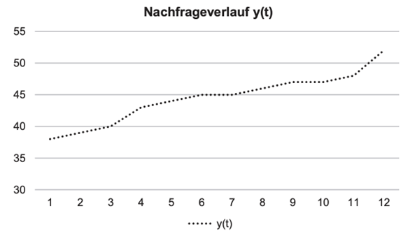

# Predictive Analytics

## Task 1: Prognose für einen Gewürzhersteller

### Angabe

Der Gewürzhersteller Pfefferling verwendet zur Prognose der Kundennachfrage für schwarzen Pfeffer das Verfahren der einfachen exponentiellen Glättung mit $\alpha$ = 0,2. Das nachfolgende Diagramm zeigt Ihnen grafisch den Nachfrageverlauf $y(t)$ der Perioden 1–12 (in Mengeneinheiten). Die anschließende Tabelle gibt Ihnen die dazugehörigen Zahlenwerte.

| $t$       | $y(t)$ | $\hat{y}(t)$ |
| --------  | -------| -------      |
| 1         | 38     | 40,00        |
| 2         | 39     | 39,60        |
| 3         | 40     | 39,48        |
| 4         | 43     | 39,58        |
| 5         | 44     | 40,26        |
| 6         | 45     | 41,01        |
| 7         | 45     | 41,81        |
| 8         | 46     | 42,45        |
| 9         | 47     | 43,16        |
| 10        | 47     | 43,93        |
| 11        | 48     |              |
| 12        | 52     |              |

### Aufgaben

1. Prognostizieren Sie den Absatz $\hat{y}(t)$ für t=11 und t=12 anhand des Verfahrens der einfachen exponentiellen Glättung. Verwenden Sie als Glättungsfaktor $\alpha$ = 0,2.
2. Wie sollte Pfefferling den Glättungsfaktor $\alpha$ anpassen, damit seine Prognose schneller auf Niveauverschiebungen reagiert (ohne Rechnung)?
3. Ist das von Pfefferling angewandte Verfahren für das Produkt und dessen Nachfrageverlauf angemessen? Geben Sie eine kurze begründete Antwort und machen Sie gegebenenfalls eine Empfehlung (ohne Rechnung).
