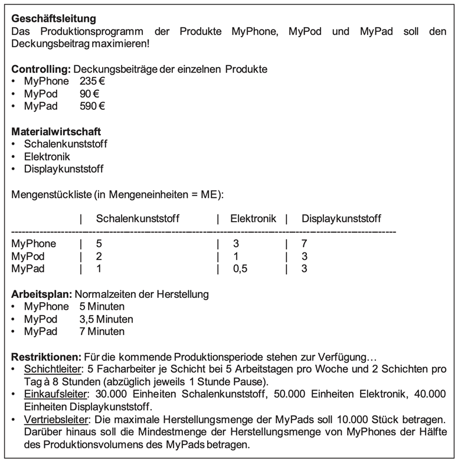
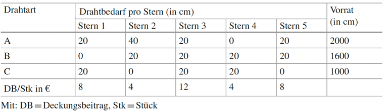
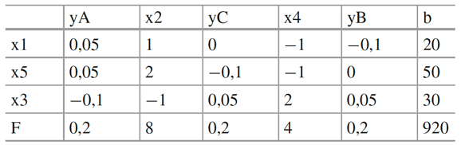
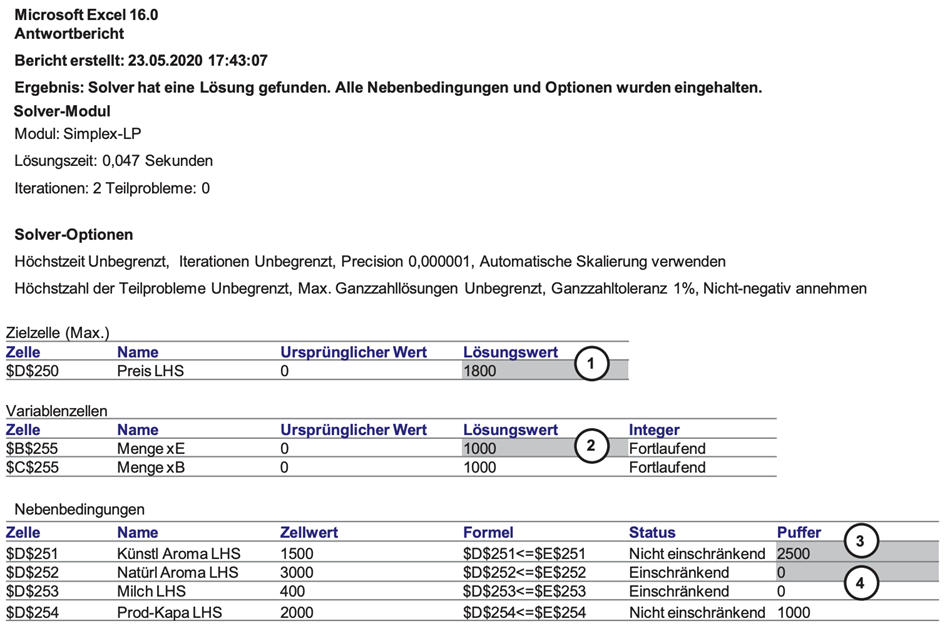
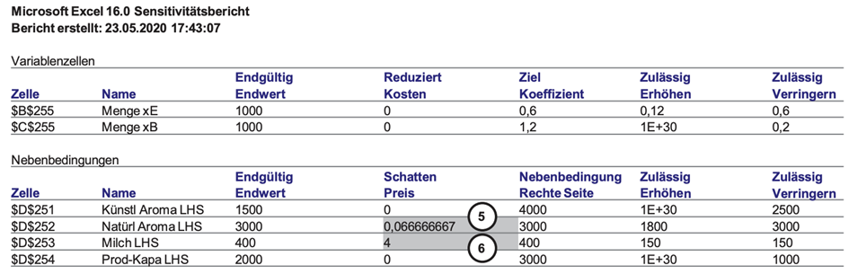
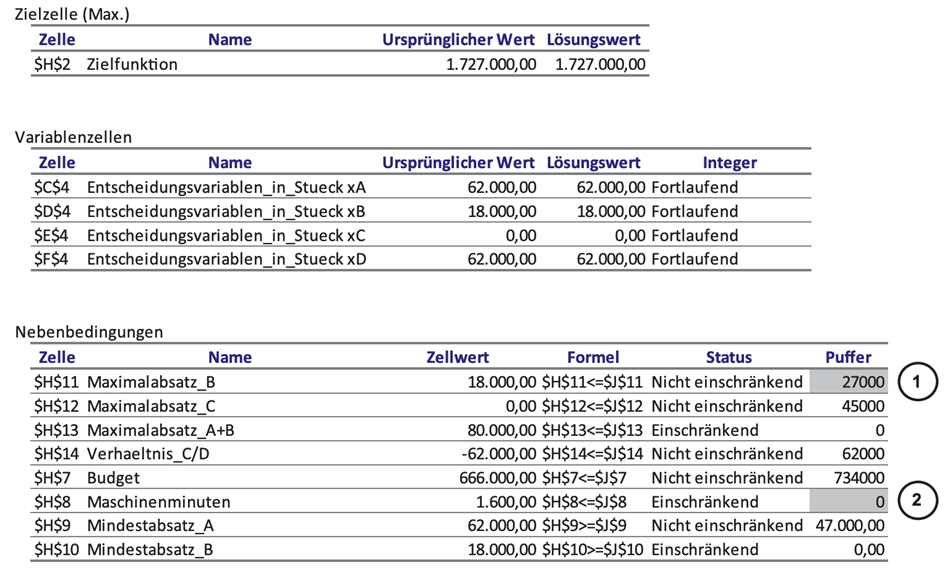
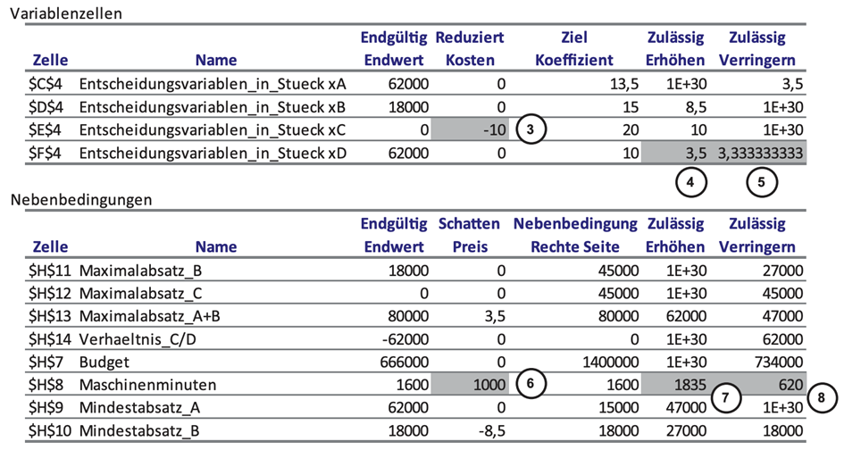

# Predictive Analytics

## Task 1: Formulierung eines Linearen Programms bei einem Elektronikhersteller

### Aufgabe

Sie sind als Produktionsplaner bei der Elektronikfabrik Regensburg angestellt und sollen die Produktionsentscheidung für die kommende Produktionsperiode, die insgesamt vier Wochen umspannen wird, zur Herstellung der Hauptprodukte MyPhone, MyPod und MyPad unterstützen. Nach mehreren Gesprächen mit Kollegen und Vorgesetzten sowie einer eingehenden Durchsicht der im ERP-System abgelegten Fertigungsinformationen haben Sie die nachfolgenden Informationen auf Ihrem Notizzettel stehen. Formulieren Sie die Produktionsplanentscheidung als Lineares Programm!

### Lösung

## Task 2: Grafische Lösung eines Linearen Programms bei einem Computerhersteller

### Aufgabe

Ein Regensburger Computerhersteller stellt in zwei Werken (Standorte Reinhausen und Kneiting) Laptops und All-in-One-PCs her, die sich durch ihre Custom-Built-Gehäuse von Konkurrenzprodukten abheben. Sie sollen als Assistenz der Produktionsleitung Vorschläge für die Formulierung eines wöchentlichen Linearen Programms mit dem Ziel der Deckungsbeitragsmaximierung machen. Ihre Informationssuche beenden Sie mit den folgenden Notizen:

- Im Reinhausener Werk, in dem die grundlegenden Montagearbeiten durchgeführt werden, werden für die Bearbeitung eines Laptops 4 min und für die Bearbeitung eines PCs 10 min benötigt.
- Im Kneitinger Werk, in dem die Endmontage erfolgt, sind pro Laptop und PC je 6 min Bearbeitungszeit notwendig.
- Die Kapazität des Reinhausener Werks beträgt für beide Produkte zusammen 360 min pro Woche.
- Die Kapazität des Kneitinger Werks beträgt für beide Produkte zusammen 270 min pro Woche.
- Zudem ist bekannt, dass der Hersteller an einem PC 300 Geldeinheiten (GE) und an einem Laptop 200 GE an Deckungsbeitrag einnimmt.

Wie viele Laptops und PCs sollte das Unternehmen wöchentlich herstellen, um seinen Deckungsbeitrag zu maximieren? Gehen Sie davon aus, dass es keine weiteren Beschränkungen (z.B. bezüglich der Absatzzahlen und der Mengenverhältnisse) gibt. Formulieren Sie zur Lösung das Lineare Programm und bestimmen Sie grafisch die optimale Lösung!

### Lösung

## Task 3: Anwendung des Simplex-Algorithmus und Endtableau-Interpretation auf dem Christkindlmarkt

### Aufgabe

Ein Budenbesitzer auf dem Schwandorfer Christkindlmarkt fertigt für die Weihnachtszeit verschiedene Drahtsterne 1–5. Für die Herstellung der Sterne werden drei Typen von Draht A-C verwendet, von denen dem Budenbesitzer jeweils nur ein begrenzter Vorrat zur Verfügung steht. Je nach Stern werden unterschiedliche Mengen Draht (in cm) benötigt. Die planungsrelevanten Daten sind in der nachfolgenden Tabelle zusammengestellt.

1. Formulieren Sie das Lineare Programm, dessen Lösung das deckungsbeitragsmaximale Produktionsprogramm pro Weihnachtszeit angibt! Nehmen Sie dabei an, dass die hergestellten Produkte vollständig abgesetzt werde können.
2. Lösen Sie das Lineare Programm mithilfe des Simplex-Algorithmus!
3. Geben Sie eine betriebswirtschaftliche Interpretation des nachfolgenden Endtableaus!

### Lösung

## Task 4: Grafische Lösung eines Linearen Programms

### Aufgabe

Die Mensa der Universität Klein Weilersheim muss über die Produktionsmengen für die beiden Produkte "Erdbeer-Joghurt" und "Bio-Erdbeer-Joghurt" entscheiden. Dabei ist ihr Ziel die Maximierung des Umsatzes. Der Unterschied zwischen beiden Produkten ist, dass für "Erdbeer-Joghurt" künstliche Aromen und für "Bio-Erdbeer-Joghurt" natürliche Aromen eingesetzt werden. Folgende Informationen liegen vor:

- Insgesamt stehen 4 kg künstliches Erdbeer-Aroma und 3 kg natürliches Erdbeer-Aroma zur Verfügung. Bei der Produktion von "Erdbeer-Joghurt" wird je Glas 1,5 g künstliches Aroma benötigt. Bei der Herstellung von "Bio-Erdbeer-Joghurt" sind es je Glas 3 g natürliches Aroma.
- Für die Herstellung eines Glases "Erdbeer-Joghurt" werden 0,15 l Milch verbraucht. Ein Glas "Bio-Erdbeer-Joghurt" benötigt hingegen 0,25 l Milch. Insgesamt können von den Lieferanten 400 l Milch zur Verfügung gestellt werden.
- Die Produktionskapazität der Uni-Mensa im Planungszeitraum beträgt 3000 Gläser.
- Die Preise der beiden Produkte betragen 0,6 Geldeinheiten (GE) pro Glas "Erdbeer-Joghurt" und 1,2 GE pro Glas "Bio-Erdbeer-Joghurt".

1. Stellen Sie das lineare Optimierungsproblem auf! Erläutern Sie dabei auch die eingeführten Variablen, die Zielfunktion sowie die Nebenbedingungen.
2. Lösen Sie das Optimierungsproblem grafisch! Kennzeichnen Sie den zulässigen Bereich. Geben Sie anschließend die optimalen Produktionsmengen und den Zielfunktionswert an.
3. Ein Mitarbeiter hat das Optimierungsproblem mit dem Excel Solver gelöst. Als Ergebnis legt er Ihnen den Antwort- und den Sensitivitätsbericht vor. Interpretieren Sie die grau eingefärbten Zellen nach ihrer betriebswirtschaftlichen Bedeutung!

### Lösung

## Task 5: Formulierung eines Linearen Programms und Endtableau-Interpretation

### Aufgabe

Der Handyhersteller TopHandy bereitet sich auf das Weihnachtsgeschäft vor und betraut Sie mit der Aufgabe, das deckungsbeitragsmaximale Produktionsprogramm zu ermitteln. Die Rahmenbedingungen sind wie folgt:

- TopHandy vertreibt vier Handy-Modelle A, B, C und D.
- In der Vorweihnachtszeit steht ein Budget von 1.400.000 € zur Produktion zur Verfügung.
- Die Herstellkosten der einzelnen Modelle belaufen sich auf 5 €, 6 €, 8 € und 4 € für die Modelle A, B, C und D.
- In der Produktionsabteilung stehen maximal 1600 Maschinenminuten zur Verfügung, wobei 100 Handys von Typ A (Mittelklasse) 1 min verbrauchen, vom Typ B (Mittelklasse) 2 min, vom Premiumhandy C 3 min und vom Einsteigermodell D 1 min.
- Aufgrund der Liefervereinbarungen müssen mindestens 15.000 Stück von A und 18.000 Stück von Typ B geliefert werden.
- Die Marketingabteilung teilt Ihnen mit, dass ein Exklusivitätseffekt generiert werden soll und deshalb nicht mehr als 45.000 Stück von B produziert werden sollen, nichtmehr als 45.000 von Typ C und dass von A und B zusammen nicht mehr als 80.000 Stück hergestellt werden sollen.
- Weiterhin sollen Sie vom Einsteigermodell D mindestens die doppelte Menge wie vom Premiummodell C fertigen.

Ihr Vorgänger hat den Excel Solver benutzt, um das Ergebnis zu ermitteln. Ihnen liegen der Antwort- und der Sensitivitätsbericht vor.

1. Formulieren Sie das Lineare Programm! Geben Sie dabei die Indizes, die Entscheidungsvariablen, sowie alle Nebenbedingungen und die Zielfunktion an.
2. Erklären Sie die betriebswirtschaftliche Bedeutung der markierten Zellen des Antwortberichtes und des Sensitivitätsberichtes.

### Lösung

